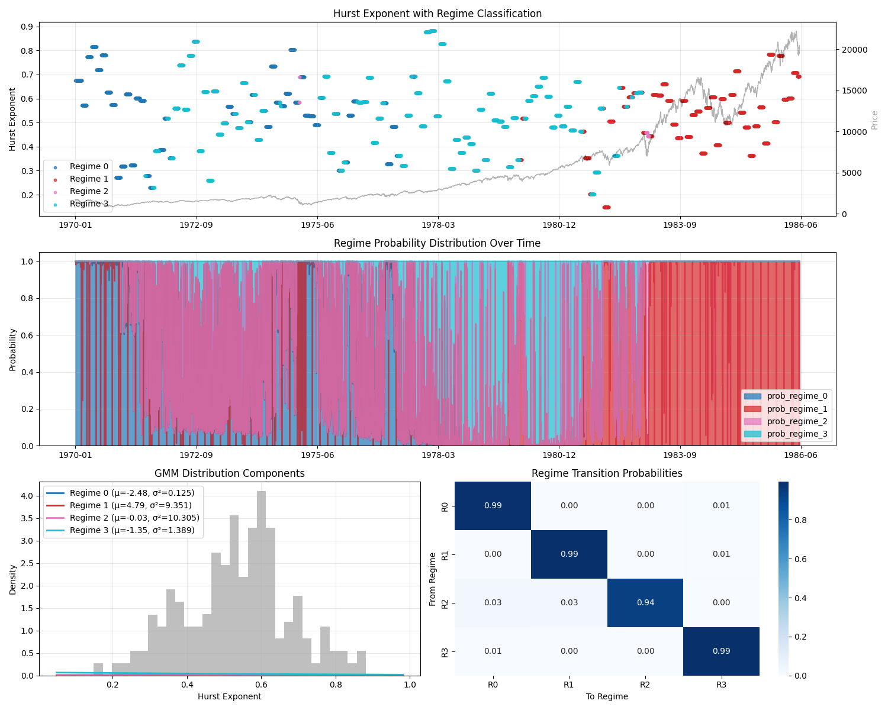

# Regime Detection and Analysis Using BIC and AIC to determine Number and Shape of Regimes

## Project
- Uses A GMM to identify the market regimes
- Iterates over data calculating the BIC to determine the number of regimes and their components
- Market Stress and understanding calculated over time using the regimes

## Results

  

## How to Run
pip install -r requirements.txt
python src/regime_det_gmm.py
